# 🏆 Apex Legends Cheat Software – Next-Gen Competitive Enhancer

Welcome to the ultimate *Apex Legends* enhancement tool — engineered for accuracy, visibility, and pure tactical advantage.
Built for Windows users, this software merges powerful **ESP overlays**, **auto-aim precision**, and **configurable targeting modules** for every weapon class.

Whether you’re climbing ranked or surviving chaotic drops, this system adapts to your playstyle and settings effortlessly.

[]()

---

## ⚙️ Overview

The **Apex Legends Cheat Software** was developed for **low-latency injection** and **real-time positional awareness**.
It runs smoothly even on mid-range setups, providing accurate aim lock and non-invasive visuals that don’t disrupt your field of view.

>[!NOTE]
> The software focuses on **customizability**, allowing users to adjust every parameter — from FOV scaling to target prioritization — without manual code edits.


### Core Benefits

* Enhance aiming accuracy instantly 🎯
* Reveal enemy locations via **wall vision ESP**
* Track loot, ammo, and armor pickups
* Stay undetected with built-in anti-scan cloaking
* Configure aim assist strength and sensitivity
* Stream-safe with overlay masking


---

## 🔍 Key Features

| Feature              | Description                                                 |
| -------------------- | ----------------------------------------------------------- |
| **Smart Aim Module** | Adaptive target locking based on weapon recoil patterns.    |
| **ESP Overlay**      | Displays enemy outlines, health bars, and distance markers. |
| **Loot Filter**      | Highlights high-tier items and color-codes gear.            |
| **Smooth Injection** | Lightweight kernel-based loader to prevent lag spikes.      |
| **Config Profiles**  | Save/load presets (sniper mode, close combat, hybrid).      |
| **Anti-Detection**   | Encrypted memory access and randomized injection paths.     |


---

## 🧩 Compatibility

| Platform                    | Supported                         |
| --------------------------- | --------------------------------- |
| **Windows 10/11 (64-bit)**  | ✅                                 |
| **Steam / Origin / EA App** | ✅                                 |
| **Controller Input**        | ✅                                 |
| **Crossplay Lobbies**       | ✅ (overlay adjusts automatically) |

>[!IMPORTANT]
> For best performance, disable third-party overlays (e.g., Discord, GeForce Experience) before injection.

---

## ⚡️ Setup Guide

1. **Download** the verified Apex Legends Cheat package.
2. **Run** as Administrator to initialize the injector.
3. **Launch** *Apex Legends* from your preferred client (Steam/Origin).
4. Once in-game, press

   ```bash
   F2 – Toggle ESP  
   F3 – Enable Aim Assist  
   F6 – Load Config Preset  
   ```
5. Adjust the **FOV slider** and **target bone priority** in the in-game UI.

>[!WARNING]
> Never change the injection process mid-match — always restart the session for stability.

---

### 🧠 System Flow (Mermaid Diagram)

```mermaid
flowchart TD
A[Start Software] --> B{Injection Detected?}
B -- No --> C[Initialize Loader]
B -- Yes --> D[Abort + Notify User]
C --> E[ESP Overlay Enabled]
E --> F[User Config Loaded]
F --> G[Active Aim Module]
G --> H[In-Game Advantage 💥]
```



---

## ❓ FAQ

**Q: Does this work with the latest Apex update?**
Yes. The tool automatically synchronizes with every new build through encrypted config patches.

**Q: Can I create my own presets?**
Absolutely — edit and export multiple `.cfg` profiles for different game modes.

**Q: Is performance affected during gameplay?**
Minimal impact. The system operates below 2% CPU utilization and dynamically scales rendering load.

**Q: What’s the safest way to use it?**
Always use the verified loader version. Avoid public files or outdated injectors to prevent flags.

**Q: How often is it updated?**
Every major *Apex Legends* patch receives an optimized offset and security refresh within 24–48 hours.

---

## 🧭 Final Thoughts

This isn’t just a utility — it’s a **competitive extension** of your reflexes.
From crystal-clear visibility to calibrated aim paths, every function was designed for seamless synergy between instinct and automation.

Take your *Apex Legends* matches beyond human precision — and enter the arena prepared.


---

*© 2025 Apex Legends Cheat Software. Optimized for stability, performance, and precision.*
